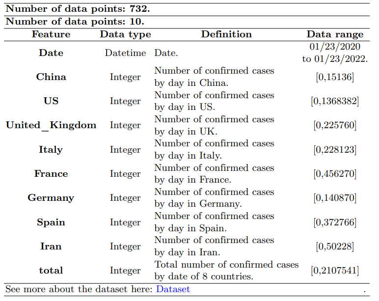
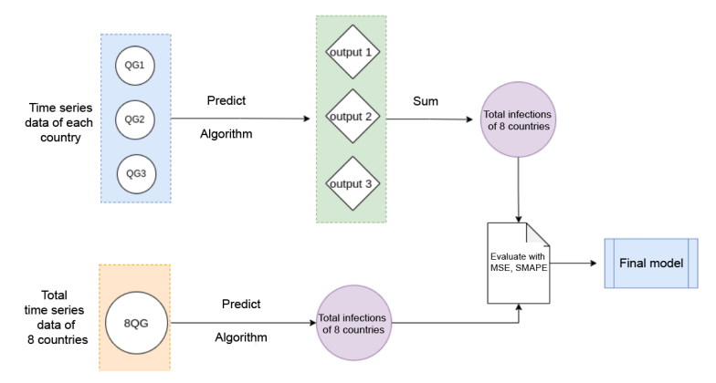
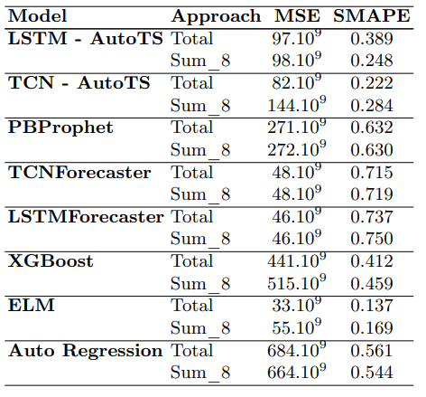
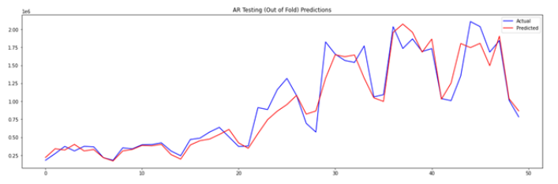

# Forecasting-COVID-19-infections-by-day-based-on-Time-series-data

Parallel and distributed computing course | DS104

UIT| 2021

## About

* A project built mainly with bigDL - a Distributed Deep Learning Framework for Big Data, focus on learning about Time Series forecasting methods, combined with various data processing techniques to solve the problem of forecasting the number of COVID-19 infections by day.
* Techniques applied:
> * Models: MLSTMForecaster, TCNForecaster, AutoTSEstimator, ELM, XGBoost and more.
> * Metrics: MSE, sMAPE.

## Data source
* Data collection source: <a href="https://datahub.io/core/covid-19#resource-time-series-19-covid-combined" target="_blank">DATAHUB</a>.
* See here: <a href="new_Confirmed_by_day_COVID_8.csv" target="_blank">Dataset</a>.

## Some Details 
* Task
> * `Input`: A time mark by day.
> * `Output`: A respective number of confirmed cases.

* Dataset: 

<i>Fig. 1.Detailed information about dataset.</i>

* Experiment
> Take advantage of the support of TSDataset for data preprocessing and build models in two approaches, as shown in Fig 2.

<i>Fig. 2.Approach process.</i>

> The results obtained are as follows: 

<i>Fig. 3.Experiment results.</i>

<i>Fig. 4.The line chart shows the forecasting results of the ELM model.</i>

## Code

* All codes are in this repo are implemented in Google Colab.
> *Still in the process of being updated*
 
## Report

* Text report: <a href="Forecasting-COVID-19-infections-by-day-based-on-Time-series-data.pdf" target="_blank">Report</a>.

## References

* All references are cited in the report file.

